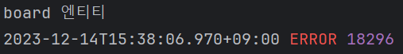

# 게시물 작성

# MariaDB에 테이블 생성

- Table > create Table


- 테이블 생성
  - PK : Primary Key
  - NN : NotNull
  - Auto Increment
- id / title/ content 생성
- 테이블 옆 키로 추후 수정도 가능


# 게시글 작성 폼 생성

- resources/templates/boardwrite.html 생성

```html
<!DOCTYPE html>
<html lang="en">
  <head>
    <meta charset="UTF-8" />
    <title>게시물 작성폼</title>
  </head>
  <style>
    .layout {
      width: 500px;
      margin: 0 auto;
      margin-top: 40px;
    }

    .layout > input {
      width: 100%;
      box-sizing: border-box;
      margin-top: 10px;
    }

    .layout > textarea {
      width: 100%;
      margin-top: 10px;
      min-height: 300px;
    }
  </style>
  <body>
    <div class="layout">
      <input type="text" />
      <textarea></textarea>
      <button>작성</button>
    </div>
  </body>
</html>
```

- 컨트롤러로 특정 주소에 view 파일을 연결
  - http://localhost:8080//board/write 주소를 요청하면, boardwrite html 파일로 응답

```java
@Controller
public class BoardController {
    @GetMapping("/board/write") // http://localhost:8080/board/write
    public String boardWriteForm() {

        return "boardwrite"; // 어떤 view 파일로 보낼지 입력
    }
}
```

- 실행 결과


# 게시글 작성 처리

- 현재 상태에서는 작성한 글이 처리되지 않음
- +) 단축키 : shift + 방향키 : 누르면 감싸짐 / ctrl + shift + 방향키 : 이동 가능

boardwrite

- 입력창을 form 태그로 감싸줌
- post 형식으로 http://localhost:8080/board/writepro 경로로 보내준다.

```html
<div class="layout">
  <form action="/board/writedo" method="post">
    <input name="title" type="text" />
    <textarea name="content"></textarea>
    <button type="submit">작성</button>
  </form>
</div>
```

- 실행결과


- 데이터가 잘 전달되는지 확인

  - Post 형식으로 전달하므로 Postmapping, 우리가 전달한 페이지로 경로 잡아주기
  - title과 content 받아서 출력해보기
  - 매개변수 전달 시 스프링 부트 3.2부터 매개변수 이름 인식 문제 있음

    - 자바 컴파일러에 -parameters 옵션 넣어주어야 애노테이션의 이름 생략 가능
    - 해결 방안 1
      - @RequestParam, @PathVariable에서 자주 발생
      - @RequestParam("username") String username 이렇게 작성해주기
    - 해결 방안 2

      - 컴파일 시점에 -parameters 옵션 적용

      1. IntelliJ IDEA에서 File -> Settings를 연다. (Mac은 IntelliJ IDEA -> Settings)
      2. Build, Execution, Deployment → Compiler → Java Compiler로 이동한다.
      3. Additional command line parameters라는 항목에 다음을 추가한다.
         -parameters
      4. out 폴더를 삭제하고 다시 실행한다. 꼭 out 폴더를 삭제해야 다시 컴파일이 일어난다.

    - 해결 방안3
      - Gradle을 사용해서 빌드하고 실행한다.
      - 참고로 이 문제는 Build, Execution, Deployment -> Build Tools -> Gradle에서
        Build and run using를 IntelliJ IDEA로 선택한 경우에만 발생한다. Gradle로 선택한 경우에는 Gradle이 컴파일 시점에 해당 옵션을 자동으로 적용해준다.

```java
    @PostMapping("/board/writepro")
    public String boardWritePro(@RequestParam("title") String title, @RequestParam("content") String content) {
        System.out.println("제목 : " + title);
        System.out.println("내용 : " + content);

        return "";
    }
```

- 실행 결과
- 발생하는 오류는 어느 페이지로 갈 지 지정해주지 않아서 발생


- 데이터를 DB에 저장
- 레파지토리 필요하다!
- com.study.board 하에 repository 패키지 생성
- com.study.board 하에 entity 패키지 생성, Board 클래스 생성 (DB명과 통일)

---

- Board.java 파일 작성
  - 생성해둔 DB에 맞추어 작성

```java
package com.study.board.entity;

import jakarta.persistence.*;
import lombok.Data;

// 클래스 명은 테이블 명과 일치하게 해주는 것이 좋다 !
// Entity : 테이블을 의미, JPA 에서 이 클래스가 DB에 있는 테이블을 의미
// 생성해둔 컬럼의 형식과 이름에 맞춰 작성
// JPA가 이걸 읽어들임
@Entity
@Data // data 읽어들일 수 있음
public class Board {

    @Id // PK 의미하는 어노테이트
    // IDENTITY : MySql, SEQUENCE : Oracle, Auto : 알아서 설정
    @GeneratedValue(strategy = GenerationType.IDENTITY)
    private Integer id;

    @Column // 생략 가능
    private String title;

    @Column
    private String content;
}
```

- BoardController 파일 수정
  - 엔티티 형식으로 받을 수 있다! == Board 클래스로 받을 수 있음! (import 해주어야 함)

```java
    @PostMapping("/board/writepro")
    public String boardWritePro(Board board) {
        System.out.println(board.getTitle());
        return "";
    }
```

- 실행 결과



- respository 패키지에 BoardRepository 인터페이스 생성 : 클래스 생성 후 선택
- BoardRepository 파일 작성
  - JpaRepository 상속 받음
  - 기본적인 Create, Read, Update, Delete가 자동으로 생성

```java
package com.study.board.repository;

import com.study.board.entity.Board;
import org.springframework.data.jpa.repository.JpaRepository;
import org.springframework.stereotype.Repository;

@Repository // 레포지토리임을 지정

// JpaRepository 상속 받음, 제네릭으로 타입을 지정: <DB, PK 컬럼 타입>
public interface BoardRepository extends JpaRepository<Board, Integer> {
}
```

- com.study.board 하에 service 생성 후 BoardSerivce 클래스 생성
- BoardSerivce 파일 작성

```java
package com.study.board.service;

import com.study.board.entity.Board;
import com.study.board.repository.BoardRepository;
import org.springframework.beans.factory.annotation.Autowired;
import org.springframework.stereotype.Service;

// Service임을 알림
@Service
public class BoardService {

    @Autowired // 보통 인터페이스 선언시 사용
    private BoardRepository boardRepository;

    // boardRepository에 저장
    public void write(Board board){
        boardRepository.save(board);
    }
}
```

- BoardController 파일 수정

```java
@Controller
public class BoardController {

    // boardService 선언
    @Autowired
    private BoardService boardService;

    @GetMapping("/board/write") // http:/localhost:8080/board/write
    public String boardWriteForm() {
        return "boardwrite"; // 어떤 view 파일로 보낼지 입력
    }

    @PostMapping("/board/writepro")
    public String boardWritePro(Board board) {
        // boardService의 write 활용해서 DB에 작성
        boardService.write(board);
        return "";
    }
}
```

- 실행 결과
  - mysql workbench에서 board 옆 3번째 키 클릭시 확인 가능


