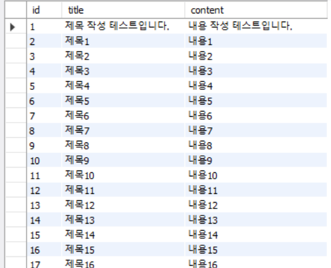
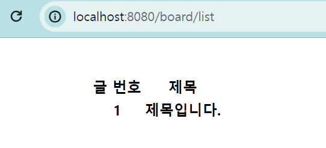

# 게시물 리스팅

# 게시글 리스트 페이지 생성

## In mariaDB

- 데이터 생성을 위한 SQL문 생성

```SQL
-- board db를 사용할 것입니다.
use board;

-- 데이터 생성하는 프로시저 생성
-- DELIMITER, END 뒤에 //로 마무리, 마지막 DELIMITERsms ;로 마무리
DELIMITER //

CREATE PROCEDURE testDataInsert()
BEGIN
    DECLARE i INT DEFAULT 1;

    WHILE i <= 120 DO
        INSERT INTO board(title, content)
          VALUES(concat('제목',i), concat('내용',i));
        SET i = i + 1;
    END WHILE;
END//
DELIMITER ;

-- 생성한 프로시저 실행
call testDataInsert;
```

- 실행 결과



## In IntelliJ

- 게시글 리스트 페이지 생성
- BoardController 파일에 boardList 추가

```java
@GetMapping("board/list")
public String boardList() {

    return "boardlist";
}
```

- boardlist html 파일 생성

```html
<!DOCTYPE html>
<html lang="en">
  <head>
    <meta charset="UTF-8" />
    <title>게시글 리스트 페이지</title>
  </head>
  <style>
    .layout {
      width: 500px;
      margin: 0 auto;
      margin-top: 40px;
    }
  </style>
  <body>
    <div class="layout">
      <table>
        <thead>
          <tr>
            <th>글 번호</th>
            <th>제목</th>
          </tr>
        </thead>
        <tbody>
          <tr>
            <th>1</th>
            <th>제목입니다.</th>
          </tr>
        </tbody>
      </table>
    </div>
  </body>
</html>
```

- 실행 결과



- 글 불러오기
- service에서 처리
  - boardList 생성 : boardRepository에 존재하는 모든 데이터 가져와 리스트로 반환

```java
public List<Board> boardList() {
        return boardRepository.findAll();
    }
```

---

+) Generic이란?

- 데이터 형식에 의존하지 않고, 하나의 값이 여러 다른 데이터 타입들을 가질 수 있도록하는 방법
- List<데이터타입> => 클래수 외부에서 사용자에 의해 지정되는 것

---

- BoardController 파일의 boardList 수정
  - boardService에서 생성한 boardList 사용, 리스트 반환함

```java
@GetMapping("/board/list")
public String boardList(Model model) {
    // boardService.boardList에서 반환된 리스트를 list라는 이름으로 받아서 넘긴다!
    model.addAttribute("list", boardService.boardList());
    return "boardlist";
}
```

- borderlist html 파일 수정
  - 타임리프 템플릿을 사용하여 데이터를 받아 처리
  -

```html
...

<html lang="en" xmlns:th="http://www.thymeleaf.org">
  ...

  <tr th:each="board : ${list}">
    <td th:text="${board.id}">1</td>
    <td th:text="${board.title}">제목입니다.</td>
  </tr>
</html>
```
