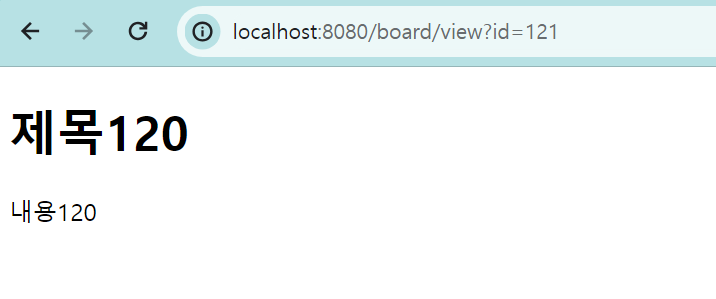
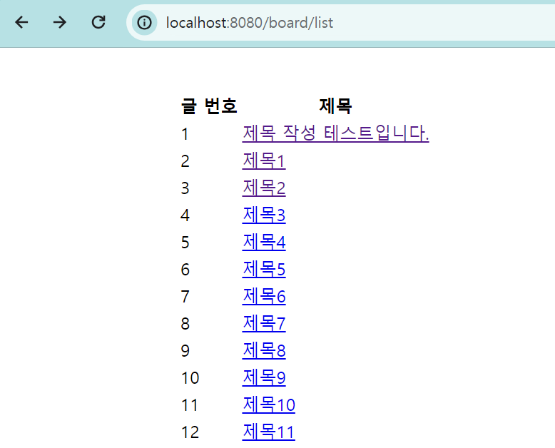
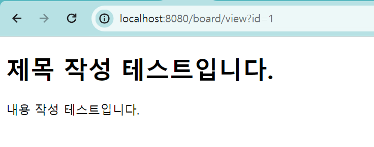

# 게시글 상세페이지

# 게시글 상세 페이지 생성

## 상세 페이지 생성

- templates/boardview html 파일 생성

```html
<!DOCTYPE html>
<html lang="en">
  <head>
    <meta charset="UTF-8" />
    <title>게시글 상세 페이지</title>
  </head>
  <body>
    <h1>제목입니다.</h1>
    <p>내용이 들어갈 부분입니다.</p>
  </body>
</html>
```

- BoardController 코드 추가
  - http://localhost:8080/board/view 로 get메서드 매핑
  - boardview.html로 연결

```java
@GetMapping("board/view")
public String boardview() {
    return "boardview";
}
```

## id에 따른 상세 페이지 출력

- service/BoardService 코드 추가
  - findById : Integer 형태의 id 값에 따라 데이터 불러오는 메소드
  - findById는 Optional 클래스(null일 수도 있는 객체를 갑싸는 일종의 Wrapper 클래스)
    - .get() : Optional 내부에 답긴 객체 반환
    - null인 객체라면 NoSuchElementException이 발생

```java
// 특정 게시글 불러오기
public Board boardView(Integer id) {

    return boardRepository.findById(id).get();
}
```

### 타임리프(Thymeleaf) 관련 정리 ([참고])(https://chb2005.tistory.com/77)

타임리프(Thymeleaf) : 템플릿 엔진 중 하나, HTML태그를 기반으로 **th:속성**을 추가해 동적인 View를 제공

- html 파일에 아래 코드 추가

```html
<html xmlns:th="http://www.thymeleaf.org"></html>
```

- 사용 방법

1. Controller에서 HTML 페이지로 값 전송
   - Model model, Integer id 받음
   - model.addAttribut("Key", "Value")형식으로 model에 data를 담아 전송 가능
   - value로는 Integer, String, Object 등 전송 가능
   - return하면 해당 html로 데이터를 가져감
2. HTML 페이지에서 값 받기
   - Controller에서 Model를 통해 data 전송했음
   - HTML파일에서 ${Key}로 Value 값을 받을 수 있음
3. 형식에 따라 th:속성 으로 값 받아서 활용

#### Model 객체 ([참고])(https://dev-coco.tistory.com/100)

Controller에서 생성된 데이터를 담아 View로 전달할 때 사용하는 객체

- Servlet의 request.setAttrivute()와 비슷한 역할을 함
- addAttribut('Key', 'Value')메서도를 이용해 view에 전달할 데이터를 Key, Value 형식으로 전달할 수 있음

- BoardController의 boardview 수정
  - Model model, Integer id 받음
  - model.addAttribut("Key", "Value")형식으로 model에 data를 담아 전송 가능
  - value로는 Integer, String, Object 등 전송 가능
  - 이렇게 return하면 templates/boardview.html에 model을 가지고 감

```java
// http:/localhost:8080/board/view?id=1 : get 방식
@GetMapping("/board/view")
public String boardView(Model model, Integer id) {
    // 넘겨주기만 함, 출력하는 건 타임리프로 !
    model.addAttribute("board", boardService.boardView(id));
    return "boardview";
}
```

- boardview.html 수정 : 타임리프를 활용하여 데이터 받아 출력하기
  - Controller에서 Model를 통해 전송한 data를 ${Key}로 Value 값을 받을 수 있음
  - th:text="${board.title}" : text 형식으로 board의 title 값 받음

```html
<!DOCTYPE html>
<html lang="en" xmlns:th="http://www.thymeleaf.org">
  <head>
    <meta charset="UTF-8" />
    <title>게시글 상세 페이지</title>
  </head>
  <body>
    <!-- th로 값을 지정해주면, 해당 태그 내용으로 출력 -->
    <h1 th:text="${board.title}">제목입니다.</h1>
    <p th:text="${board.content}">내용이 들어갈 부분입니다.</p>
  </body>
</html>
```

- 결과
  

## 제목 클릭 시 상세페이지로 이동

- td 태그 수정
  - a 태그 추가하여 title 값에 href 링크 걸어주기
  - http://localhost:8080/board/view?id={id 값} 전달

```html
<td>
  <a th:text="${board.title}" th:href="@{/board/view(id=${board.id})}"></a>
</td>
```

- 실행 결과
    
  
