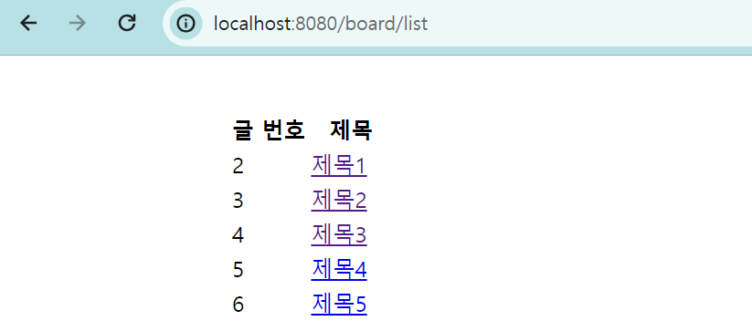

# 게시글 삭제

# 버튼 생성 및 삭제 처리

## 글 삭제 버튼 생성

- boardview.html 코드 추가
  - a 태그로 삭제 처리하는 링크 연결, 현재는 #으로 설정

```html
<a href="#">글 삭제</a>
```

- 실행 결과


## 삭제 처리

- BoardService 코드 추가
- 특정 게시글 삭제 처리
  - boardDelete 생성
  - deleteById(id) : id에 따라 삭제 처리
- void:return 하지 않음을 의미

```java
// 특정 게시글 삭제
public void boardDelete(Integer id) {
    boardRepository.deleteById(id);
}
```

- BoardController 코드 추가
  - http:/localhost:8080/board/delete?id=id값 매핑
  - id 입력 받아 boardService.boardDelete로 전달
  - "redirect:/board/list" : 삭제 후 list 페이지로 redirect
    - redirect : 클라이언트에게 재요청

```java
// http:/localhost:8080/board/delete?id=1 : id 번호에 따른 값 삭제
@GetMapping("/board/delete")
public String boardDelete(Integer id){
    boardService.boardDelete(id);
    return "redirect:/board/list";
}
```

- boardview.html a태그 수정
  - th:href로 id 값을 넘겨 삭제 처리하는 링크로 연결

```html
<a th:href="@{/board/delete(id=${board.id})}">글 삭제</a>
```

### Thymeleaf에서 url을 표현하는 방법

1. Absolute URL

- 특정 url로 직접 이동이 가능
- 가장 기본적인 a 택 사용법

```html
<a th:href="@{http://www.thymeleaf/documentation.html}"></a>
```

2. Context-realtuve URL

- 가장 맣이 사용
- 우리 서버 내 특정 위치로 이동이 가능하도록 함
- 예시는 서버 내 리스소 /order/list 호출

```html
<a th:href="@{/oder/list}"></a>
```

3. Adding Parameter URL

- 파라미터를 추가하는 방식의 URL
- http://localhost:8080/order.details?id=1

```html
<a th:href="@{/order/details(id=1)}"></a>
```

- 여러 개의 파라미터는 쉼표로 구분

```html
<a th:href="@{/order/details(id=1, action='show_all')}"></a>
```

- 서버에서 받아온 값을 파라미터러 주는 방법
- 동적인 URL

```html
<a th:href="@{/order/details(id=${orderInfo.seq})}"></a>
```

- 실행 결과 : id 1번 글 삭제
  
