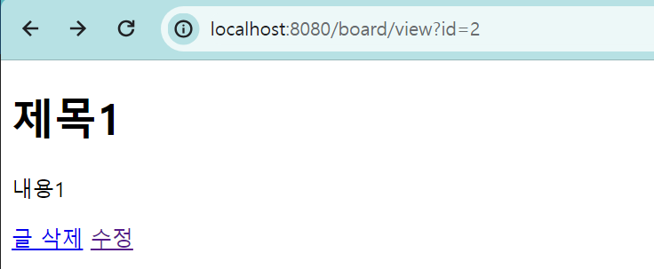
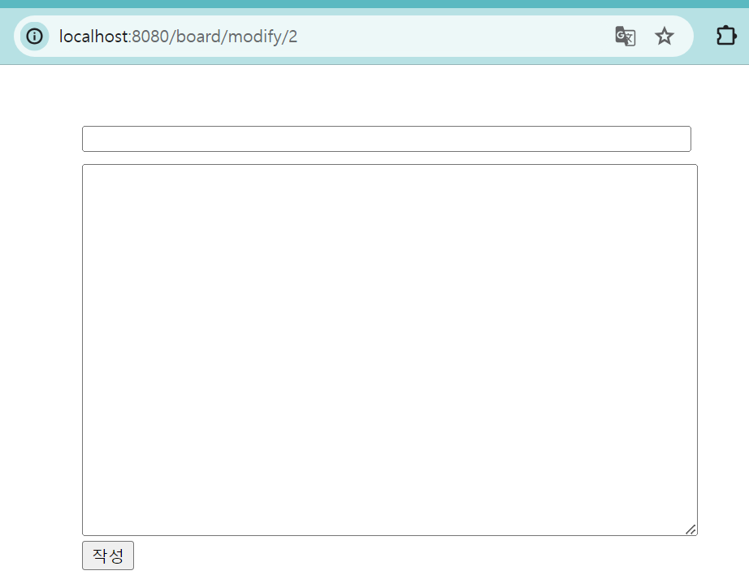
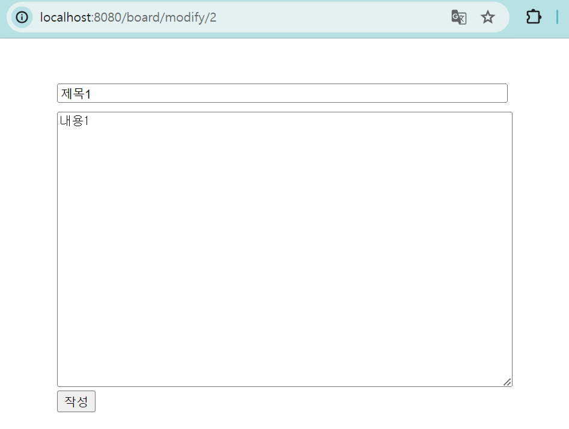
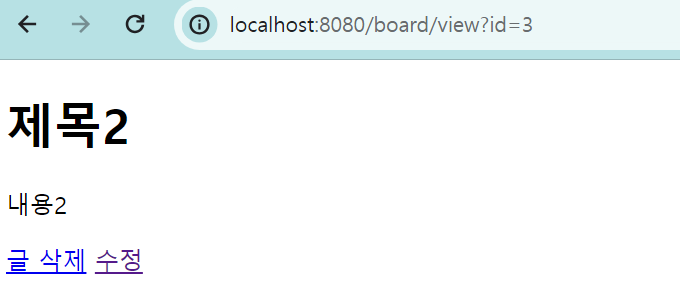
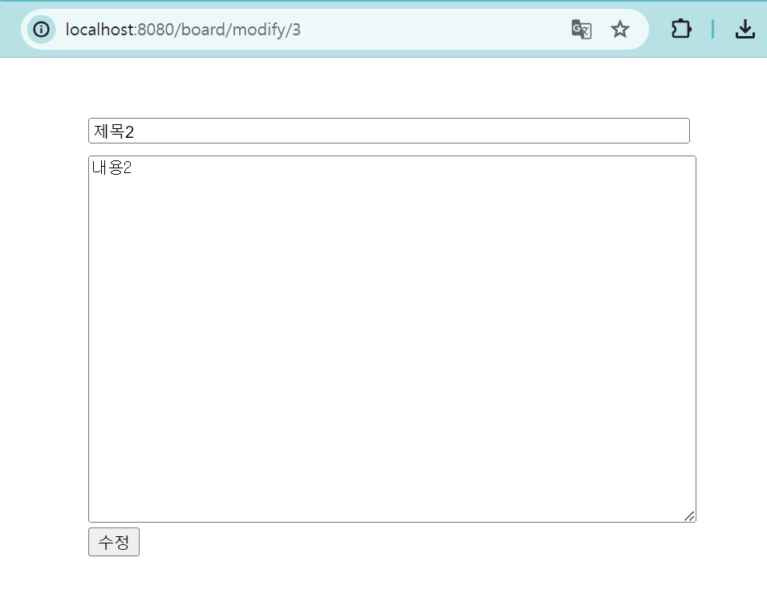
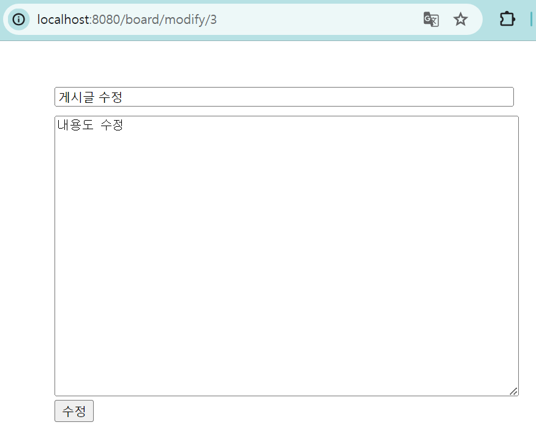
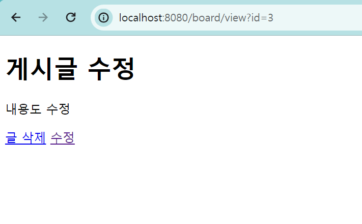
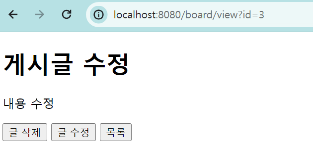
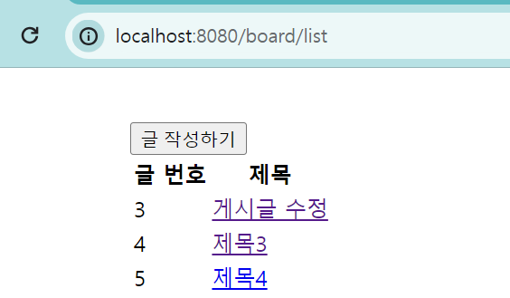
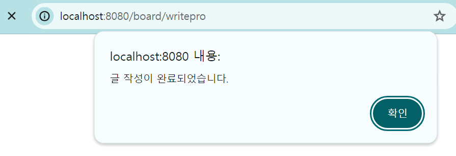

# 게시글 수정

# 게시글 수정 페이지 생성, 처리

## 수정 페이지 생성

- BoardController 코드 추가

```java
// PathVariable : id 값이 인식되어 integer 형식의 id로 들어온다는 것
@GetMapping("/board/modify/{id}")
public String boardModify(@PathVariable("id") Integer id) {
    return "boardmodify";
}
```

- boardview.html 코드 추가
  - 수정 페이지 연결
  - PathVariable 활용하여 {id}(id = ${board.id})로 id 값 전달

```html
<a th:href="@{/board/modify/{id}(id = ${board.id})}">수정</a>
```

- boardmodify.html 파일 생성

```html
<!DOCTYPE html>
<html lang="en">
  <head>
    <meta charset="UTF-8" />
    <title>게시물 작성폼</title>
  </head>
  <style>
    .layout {
      width: 500px;
      margin: 0 auto;
      margin-top: 40px;
    }

    .layout input {
      width: 100%;
      box-sizing: border-box;
      margin-top: 10px;
    }

    .layout textarea {
      width: 100%;
      margin-top: 10px;
      min-height: 300px;
    }
  </style>
  <body>
    <div class="layout">
      <form action="/board/writepro" method="post">
        <input name="title" type="text" />
        <textarea name="content"></textarea>
        <button type="submit">작성</button>
      </form>
    </div>
  </body>
</html>
```

- 실행 결과
  - PathVariable 활용하여 주소가 깔끔하게 날라옴

  


### URL의 값 전달 방식 2가지

- URL로 전달된 데이터(파라미터)를 받는 역할

1. http://localhost:8080/members?id=1&page=2
2. http://loaclhost:8080/members/1/2

#### RequestParam

클라이언트 쪽에서 전송하는 요청 데이터를 쿼리 파라미터(Query Parmeter 또는 Query String), 폼 데이터(form-data), x-www-form-urlencoded 형식으로 전송하면 이를 서버 쪽에서 전달 받을 때 사용하는 annotation

- 쿼리 파라미터(Query Parmeter 또는 Query String)
  - 요청 URI에서 '?'를 기준으로 붙듣 key=value 쌍의 데이터
  - 사용법
  1. 단일 파라미터를 받아올 때 사용하는 어노테이션
  2. 파라미터의 필수 여부 지정 가능 : required=false(default=true)
  ```java
  @GetMapping("/search_user")
  public USerDto searchUser(
    @RequestParam("name") String name,
    @RequestParam(value = "age", required=false) int age
  )
  ```
  ```
  http://localhost:8080/search_user?name=hi&age=20
  ```

#### @PathVariable

- @Controller에서 파라미터를 받는 방법 중 하나 : URL 변수(@PathVariable)
- http://localhost:8080/api/user/**1234** 의 1234에 해당하는 값 처리
- 사용법

1. GetMapping(PostMapping, PutMapping 등 상관없음)에 {변수명}
2. 메소드 정의에서 위에 쓴 변수명 그대로 @PathVariable("변수명")
3. (Optional) Parameter명은 아무거나 상관 없음

```java
@Controller
public class BoardController {
    // 기본
    @GetMapping("member/{name}")
    public String findByname(@PathVariable("name") String name) {
        return "Name: " + name;
    }

    // 여러 개
    @GetMapping("/member/{id}/{name}")
    public String findByNameAndId(@PathVariable("id") String id, @PathVariable("name") String name) {
        return "ID: " + id + ", name: " + name;
    }
}
```

## 수정 페이지에 해당 id에 따른 데이터 가져오기

- BoardController 코드 수정
  - key : board로 id에 따른 데이터를 value로 넘겨줌

```java
@GetMapping("/board/modify/{id}")
public String boardModify(@PathVariable("id") Integer id, Model model) {
    model.addAttribute("board", boardService.boardView(id));
    return "boardmodify";
}
```

- boardmodify.html 코드 수정
  - 타임리프를 활용해 value 값 넘겨줌

```html
<input name="title" type="text" th:value="${board.title}" />
<textarea name="content" th:text="${board.content}"></textarea>
```

- 실행 결과
  

## 게시글 수정 처리

- boardmodify.html 코드 수정
- th:action으로 수정 : th:action="@{/board/update/{id}(id = ${board.id})}"
- @PathVariable 사용함에 따라 입력 방식 변경

```html
<form th:action="@{/board/update/{id}(id = ${board.id})}" method="post">
  <input name="title" type="text" th:value="${board.title}" />
  <textarea name="content" th:text="${board.content}"></textarea>
  <button type="submit">수정</button>
</form>
```

- BoardController 코드 추가

  - 기존의 Query String 방식이 아닌 PathVariable를 활용하여 받아오는 방법
  - Board 형식의 데이터를 받아 수정
  - 전달 받은 id를 활용하여 새로운 Board 객체 boardTemp에 해당 id에 따른 데이터 받음
  - setTitle, setContent를 활용하여 기존에 있던 내용을 덮어 씌움
  - boardService.write(boardTemp)를 통하여 덮어씌운 내용 저장

- 추가 수정 사항
  - 기존 코드 : return "redirect:/board/list"; => 게시글 리스트로 redirect
  - 수정 코드 : return "redirect:/board/view?id={id}"; => 수정한 게시글 상세 페이지로 redirect

```java
@PostMapping("/board/update/{id}")
public String boardUpdate(@PathVariable("id") Integer id, Board board) {
    // Board 객체를 생성하여 기존에 있던 글을 검색해 담음
    Board boardTemp = boardService.boardView(id);
    // 기존에 있던 내용을 덮어 씌움
    boardTemp.setTitle(board.getTitle());
    boardTemp.setContent(board.getContent());

    boardService.write(boardTemp);

    // return "redirect:/board/list";
    return "redirect:/board/view?id={id}";
}
```

- 실행 결과

  
  
  


## 추가 기능 구현

1. 글 삭제, 수정 버튼으로 구현

- boardview.html 수정

  - button의 onclick 기능 => 타임리프를 활용하여 onclick 이벤트를 걸었다!

  ```html
  <!--  버튼으로 글 삭제, 수정  -->
  <button
    type="button"
    th:onclick="|location.href='@{/board/delete(id=${board.id})}'|"
  >
    글 삭제
  </button>
  <button
    type="button"
    th:onclick="|location.href='@{/board/modify/{id}(id = ${board.id})}'|"
  >
    글 수정
  </button>
  ```

  ### 타임리프 th:onclick 사용하기

  1. location.href 이용한 경로 이동

  ```html
  <button type="button" th:onclick="|location.href='@{/board/list}'|"></button>
  ```

  2. loaction.href 경로 이동 시에 requestParam으로 파라미터를 넘기는 경우 : Query String 방식

  ```html
  <!-- 1. 단일 파라미터인 경우 -->
  <button
    type="button"
    th:onclick="|location.href='@{/board/delete(id=${board.id})}'|"
  >
    글 삭제
  </button>
  <!-- 2. 파라미터가 여러 개인 경우 -->
  <button
    type="button"
    th:onclick="|location.href='@{/board/delete(id=${board.id}, bordSeq=${bordSeq})}'|"
  >
    글 삭제
  </button>
  ```

  3. oaction.href 경로 이동 시에 PathVariable으로 파라미터를 넘기는 경우

  ```html
  <button
    type="button"
    th:onclick="|location.href='@{/board/modify/{id}(id = ${board.id})}'|"
  >
    글 수정
  </button>
  ```

2. 글 목록으로 돌아가기

- boardview.html 수정

  - button의 onclick 기능 => 타임리프를 활용하여 onclick 이벤트를 걸었다!

  ```html
  <!-- 게시글 리스트로   -->
  <button type="button" th:onclick="|location.href='@{/board/list}'|">
    목록
  </button>
  ```

- 실행 결과



3. 글 목록에 글 작성하기 버튼 추가

- boardlist.html 수정

```html
<button type="button" th:onclick="|location.href='@{/board/write}'|">
  글 작성하기
</button>
```

- 실행 결과



# 게시글 등록, 수정 처리 메시지 출력

- templates/message.html 생성
  - inline 자바 스크립트 추가 공부 해야함
  - [[${message}]] => JSP를 활용하여 서버에서 전달받은 변수값을 사용하기 위한 변수선언...
  - 자바스크립트에서 Model 데이터를 확인하기 위해서는 CDATA를 사용해야한다! => 주석 필수 등록

```html
<!DOCTYPE html>
<html lang="en" xmlns:th="http://www.thymeleaf.org">
  <head>
    <meta charset="UTF-8" />
    <title>Title</title>
  </head>

  <!-- 컨트롤러에서 메시지를 메시지로 연결 alert가 문구 창을 띠워지는 함수, loaction하수는 페이지를 보내주는 것-->
  <script th:inline="javascript">
    /*<!CDATA[*/

    var message = [[${message}]];
    alert(message)

    location.replace([[${searchUrl}]]);

    /*]]>*/
  </script>

  <body></body>
</html>
```

### EL(Expression Language) 태그 : ${}

- 자바 빈의 프로퍼티, 값을 보다 쉽고 간결하게 꺼낼 수 있게 하는 기술
- 간단한 비교, 논리, 수치 연산도 태그 안에서 가능
- EL 문법을 통해 접근 가능한 위치는 page, request, session, context, initContext(web, xml)
- EL 표기법

  - ${}
    - JSP가 실핼될 때 즉시 반영 (Immediate evaluation)
    - 객체 프로퍼티 값을 꺼낼 때 주로 사용
  - #{}
    - 시스템에서 필요하다가 판단될 때 그 값을 사용 (Deferred evaluation)
    - 사용자 입력 값을 객체의 프로퍼티에 답는 용도로 주로 사용

- 참고 사이트
  - https://agileryuhaeul.tistory.com/entry/EL-%ED%83%9C%EA%B7%B8-%EB%9E%80-Expression-Language-Tag

### Thymelaf JavaScript Inlining : 자바스트립트 인라인 [[참고]](https://maenco.tistory.com/entry/Thymeleaf-JavaScript-Inlining-%EC%9E%90%EB%B0%94%EC%8A%A4%ED%81%AC%EB%A6%BD%ED%8A%B8-%EC%9D%B8%EB%9D%BC%EC%9D%B8)

- 자바스트립에서 타임리프 태그를 사용하기 위해서 적용
- 기능

  - Text Inlining (텍스트 렌더링)

    - 변수값을 타임리프 변수로 대입할 때 문자열에 자동으로 따옴표 추가
    - 자바스크립트에서 문제가 될 수 있는 문자가 포함되어 있다면 이스케이프 처리

    ```html
    <!-- 자바스크립트 인라인 사용 전 -->
    <script>
      var username = [[${user.username}]];
      var age = [[${user.age}]];
    </script>
    <!-- 결과 -->
    var username = name; var age = 10;

    <!-- 자바스크립트 인라인 사용 후 -->
    <script th:inline="javascript">
      var username = [[$user.username]];
      var age = [[$user.age]];
    </script>
    <!-- 결과 -->
    var username = "name"; var age = 10;
    ```

  - JavaScript Natural Templates(자바스크립트 내추럴 템플릿)

    - 타임리프가 제공하는 HTML 파일을 직접 열어도 동작하는 내추럴 템플릿 기능 사용 가능
    - 인라인 사용 X => 내추럴 템플릿 기능 동작하지 않고, 주석처리 된다!
    - 인라인 사용 O => 주석 부분이 제서되고 의도했던 userA 값이 들어간다.

    ```html
    <!-- 자바스트립트 인라인 사용 전 -->
    <script>
        var username = /*userA*/"usernameB";
      </>
      <!-- 결과 -->
      var username = /*userA*/"usernameB";

      <!-- 자바스트립트 인라인 사용 후 -->
      <script th:inline="javascript">
        var username = /*userA*/"usernameB";
    </script>
    <!-- 결과 -->
    var username = "userA";
    ```

  - Advance Inlined Evalutaion and JavaScript Serilalization (객체화)

    - 타임리프의 자바스트립트 인라인은 아래와 같은 객체들을 자동으로 객체화해준다.
      - Strings / Numbers / Booleans / Arrays / Collections / Maps / Beans(obkects with getter and setter methods)
      - json 형식으로 알아서 객체화

    ```html
    <!-- 자바스크립트 인라인 사용 전 -->
    <script>
      var user = [[${user}]];
    </script>
    <!-- 결과 -->
    var user = BasicController.User(username=UserA, age=10);

    <!-- 자바스크립트 인라인 사용 후 -->
    <script th:inline="javascript">
      var user = [[${user}]];
    </script>
    <!-- 결과 -->
    var user = {"username":"userA", "age":10}
    ```

  - JavaScript Inling Each(자바스크립트 인라인 반복)

    - 자바스크립트 인라인은 each를 지원 => 기존의 th:each와 똑같이 작동

    ```html
    <script th:inline="javascript">
      [# th:each="user, stat : ${users}"]
      var user[[${stat.count}]] = [[${user}]];
      [/]
    </script>

    <!-- 결과 동일 -->
    <script>
      var user1 = { username: "userA", age: 10 };
      var user2 = { username: "userB", age: 20 };
      var user3 = { username: "userC", age: 30 };
    </script>
    ```

- BoardController.java의 boardWritePro 코드 수정
  - Model model에 message와 searchUrl 데이터 담아 보냄
  - return message 로 보낸다 !
  - if else문으로 분기점 추가 가능 => 글 작성 실패했습니다.

```java
@PostMapping("/board/writepro")
public String boardWritePro(Board board, Model model) {
    boardService.write(board);

    model.addAttribute("message", "글 작성이 완료되었습니다.");
    model.addAttribute("searchUrl", "/board/list");
    return "message";
}
```

- 실행 결과



## 수정 시에 메시지 추가

- BoardController
